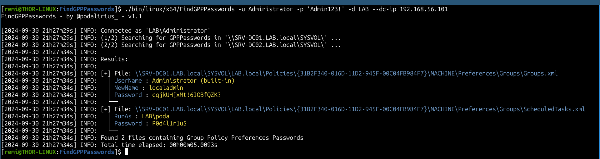
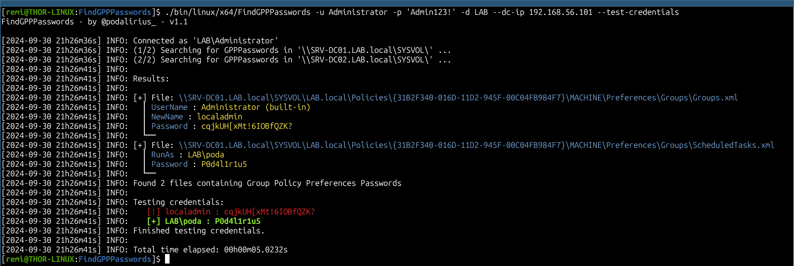

<p align="center">
    FindGPPPasswords, A cross-platforms tool to find and decrypt Group Policy Preferences passwords from the SYSVOL share using low-privileged domain accounts.
    <br>
    <a href="https://github.com/p0dalirius/FindGPPPasswords/actions/workflows/release.yaml" title="Build"></a>
    
    <a href="https://twitter.com/intent/follow?screen_name=podalirius_" title="Follow"></a>
    <a href="https://www.youtube.com/c/Podalirius_?sub_confirmation=1" title="Subscribe"></a>
    <br>
</p>


## Features

 - [x] Only requires a **low privileges domain user account**.
 - [x] Automatically gets the list of all domain controllers from the LDAP.
 - [x] Finds all the Group Policy Preferences Passwords present in SYSVOL share on each domain controller.
 - [x] Decrypts the passwords and prints them in cleartext.
 - [x] Outputs to a Excel file with option `--export-xlsx <path_to_xlsx_file>`.
 - [x] Option to test the credentials of the found GPP passwords with the `--test-credentials` option.
 - [x] Multi-threaded mode with option `--threads <number_of_threads>`.

## Demonstration

By default, the tool will only find the GPP passwords and print them in cleartext:

```bash
./FindGPPPasswords-linux-amd64 --domain <domain> --username <username> --password <password>
```



There is also the possibility to test the credentials of the found GPP passwords with the `--test-credentials` option.

```bash
./FindGPPPasswords-linux-amd64 --test-credentials --domain <domain> --username <username> --password <password>
```



## Usage

```              
$ ./FindGPPPasswords-linux-amd64 -h
FindGPPPasswords - by @podalirius_ - v1.1

Usage: FindGPPPasswords [--quiet] [--debug] [--no-colors] [--export-xlsx <string>] [--test-credentials] --domain <string> --username <string> [--password <string>] [--hashes <string>] [--threads <int>] [--nameserver <string>] --dc-ip <string> [--ldap-port <int>] [--use-ldaps]

  -q, --quiet      Show no information at all. (default: false)
  -d, --debug      Debug mode. (default: false)
  -nc, --no-colors No colors mode. (default: false)

  Additional Options:
    -x, --export-xlsx <string> Path to output Excel file. (default: "")
    -tc, --test-credentials    Test credentials. (default: false)

  Authentication:
    -d, --domain <string>   Active Directory domain to authenticate to.
    -u, --username <string> User to authenticate as.
    -p, --password <string> Password to authenticate with. (default: "")
    -H, --hashes <string>   NT/LM hashes, format is LMhash:NThash. (default: "")
    -T, --threads <int>     Number of threads to use. (default: 0)

  DNS Settings:
    -ns, --nameserver <string> IP Address of the DNS server to use in the queries. If omitted, it will use the IP of the domain controller specified in the -dc parameter. (default: "")

  LDAP Connection Settings:
    -dc, --dc-ip <string>  IP Address of the domain controller or KDC (Key Distribution Center) for Kerberos. If omitted, it will use the domain part (FQDN) specified in the identity parameter.
    -lp, --ldap-port <int> Port number to connect to LDAP server. (default: 0)
    -l, --use-ldaps        Use LDAPS instead of LDAP. (default: false)
```

## Contributing

Pull requests are welcome. Feel free to open an issue if you want to add other features.
